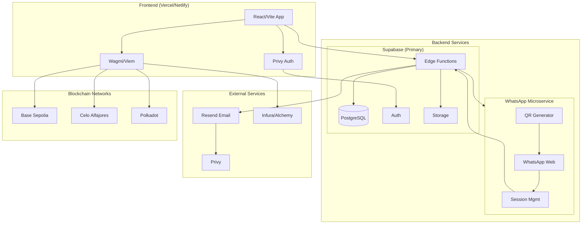
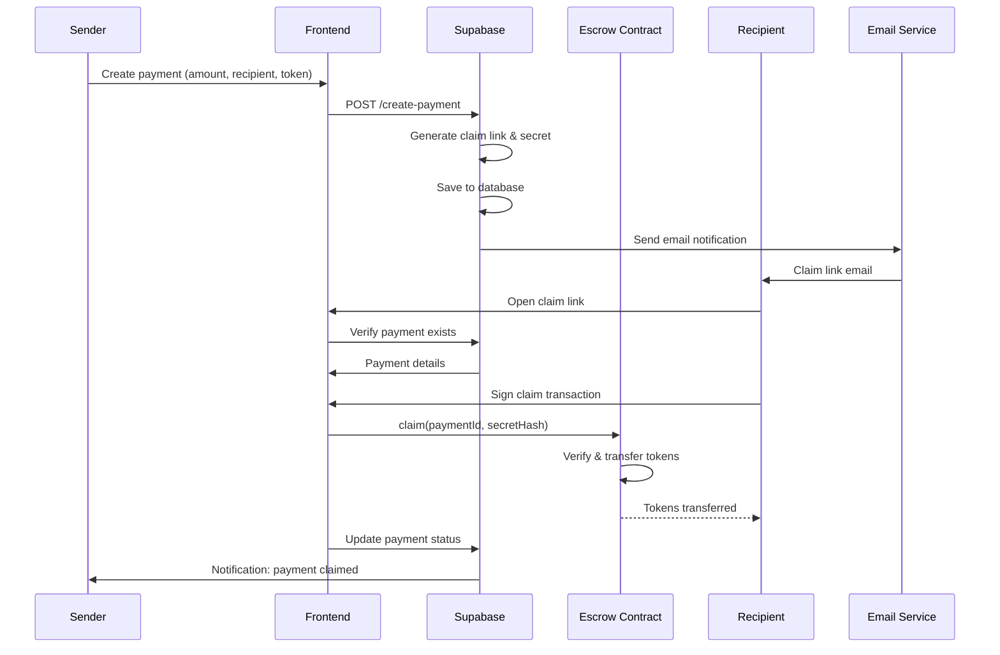

# System Architecture

## Overview

PeyDot uses a **hybrid architecture** combining Supabase Edge Functions with a dedicated WhatsApp microservice for optimal cost and functionality.

## Architecture Diagram (Mermaid)



## Payment Flow (Mermaid)



## Contract Addresses

| Network | Chain ID | Escrow Contract | USDC Token |
|---------|----------|-----------------|-------------|
| Base Sepolia | 84532 | `***REMOVED***` | `0x036CbD53842c5426634e7929541eC2318f3dCF7e` |
| Celo Alfajores | 44787 | `***REMOVED***` | `0x01C5C0122039549AD1493B8220cABEdD739BC44E` |
| Polkadot (Paseo) | 420420417 | `***REMOVED***` | PASS Token |

## Architecture Diagram (ASCII)

```
┌─────────────────────────────────────────────────────────────────┐
│                     Production Architecture                      │
├─────────────────────────────────────────────────────────────────┤
│                                                                 │
│  ┌─────────────────────────────────────────────────────────┐   │
│  │                     Frontend (Vercel)                    │   │
│  │  • React/Vite application                                │   │
│  │  • Privy authentication                                  │   │
│  │  • Wagmi/viem blockchain interactions                    │   │
│  └─────────────────────────────────────────────────────────┘   │
│                            │                                    │
│  ┌─────────────────────────┼──────────────────────────────┐    │
│  │                         │                              │    │
│  │  ┌──────────────┐       │       ┌──────────────────┐  │    │
│  │  │   Supabase   │       │       │   WhatsApp       │  │    │
│  │  │  (Primary)   │       │       │   Microservice   │  │    │
│  │  │              │       │       │                  │  │    │
│  │  │ • Database   │◄──────┼──────►│ • QR Code Auth   │  │    │
│  │  │ • Auth       │  Webhooks    │ • WhatsApp Web    │  │    │
│  │  │ • Edge Funcs │       │       │ • Session Mgmt   │  │    │
│  │  │ • Storage    │       │       │ • Forward Events │  │    │
│  │  └──────────────┘       │       └──────────────────┘  │    │
│  │                         │                              │    │
│  └─────────────────────────┼──────────────────────────────┘    │
│                            │                                    │
│  ┌─────────────────────────┴──────────────────────────────┐    │
│  │                  External Services                     │    │
│  │  • Resend (Email)      • Infura/Alchemy (RPC)         │    │
│  │  • Privy (Auth)        • WhatsApp Web                  │    │
│  └─────────────────────────────────────────────────────────┘    │
└─────────────────────────────────────────────────────────────────┘
```

## Component Details

### 1. Supabase (Primary Backend)
**Cost**: Free tier (500K invocations/month) → $0-25/month

**Responsibilities:**
- **Database**: PostgreSQL for user data, payments, notifications
- **Authentication**: User signup/login (Privy integration)
- **Edge Functions**: API endpoints for payments, webhooks, user management
- **Storage**: File storage (if needed)
- **Real-time**: Live updates for payment status

**Key Functions:**
- `create-payment` - Create escrow payments
- `claim-payment` - Claim payments via link
- `send-payment-notification` - Email notifications
- `webhook-register` - Developer webhook registration
- `webhook-dispatcher` - Event broadcasting
- `public-api` - Developer API endpoints

### 2. WhatsApp Microservice
**Cost**: $5-10/month (small VPS)

**Responsibilities:**
- **QR Code Generation**: Scan to authenticate WhatsApp
- **WhatsApp Automation**: Using `@whiskeysockets/baileys`
- **Session Management**: Persistent WhatsApp sessions
- **Event Forwarding**: Send WhatsApp events to Supabase

**Why it needs its own server:**
- WhatsApp Web requires persistent WebSocket connection
- QR code scanning needs browser interaction
- Sessions must stay alive 24/7
- Can't run reliably in stateless Edge Functions

**Endpoints:**
- `POST /whatsapp/login` - Generate QR code for authentication
- `POST /whatsapp/webhook` - Receive WhatsApp messages
- `POST /whatsapp/send` - Send messages via WhatsApp

### 3. Frontend
**Cost**: Free (Vercel/Netlify)

**Responsibilities:**
- User interface
- Privy wallet integration
- Blockchain interactions via wagmi/viem
- API calls to Supabase and WhatsApp service

## Data Flow Examples

### Magic Link Payment Flow:
```
1. User → Frontend: Create payment request
2. Frontend → Supabase: POST /create-payment
3. Supabase Edge Function:
   - Save payment to database
   - Generate claim link
   - Send email notification
4. Recipient clicks claim link
5. Frontend → Supabase: POST /claim-payment
6. Supabase updates database status
```

### WhatsApp Payment Flow:
```
1. User → WhatsApp: "Send 50 USDC to alice@email.com"
2. WhatsApp Microservice:
   - Parse message
   - Call Supabase API to create payment
   - Send confirmation to user
3. Supabase: Process payment, send email to recipient
4. Recipient claims via link
```

### Developer API Flow:
```
1. Developer → Supabase: POST /public-api/create-payment
2. Supabase Edge Function:
   - Validate API key
   - Process payment
   - Dispatch webhook events
3. Developer's webhook URL receives events
```

## Cost Breakdown

| Component | Monthly Cost | Notes |
|-----------|-------------|-------|
| WhatsApp Microservice (VPS) | $5-10 | Small instance, 24/7 |
| Supabase Free Tier | $0 | 500K invocations, 500MB storage |
| Supabase Pro (if needed) | $25 | For higher usage |
| Email (Resend) | $0-10 | 3K free emails/month |
| **Total Estimated** | **$5-35/month** | vs $20-50 with monolithic server |

## Migration Strategy

### Phase 1: Separate Services (Current)
- ✅ WhatsApp service already separate
- ✅ Supabase Edge Functions exist
- Need: Migrate remaining Express endpoints to Supabase

### Phase 2: Documentation & Monitoring
- Document dual-backend architecture
- Add cost monitoring
- Optimize WhatsApp service

### Phase 3: Future Optimization
- Evaluate warm instances for WhatsApp
- Consider serverless alternatives
- Scale based on usage patterns

## Environment Configuration

### Main App (.env)
```
# Supabase
VITE_SUPABASE_URL=https://xxx.supabase.co
VITE_SUPABASE_PUBLISHABLE_KEY=xxx
SUPABASE_SERVICE_ROLE_KEY=xxx

# WhatsApp Microservice
WHATSAPP_SERVICE_URL=http://localhost:3002
WHATSAPP_SERVICE_SECRET=xxx

# Blockchain
VITE_ESCROW_CONTRACT_ADDRESS=0x...
VITE_USDC_ADDRESS=0x...
```

### WhatsApp Service (.env)
```
# WhatsApp Session
WHATSAPP_SESSION_PATH=.baileys_auth

# Supabase Integration
SUPABASE_URL=https://xxx.supabase.co
SUPABASE_SERVICE_KEY=xxx

# Privy Integration
PRIVY_APP_ID=xxx
```

## Security Considerations

1. **Private Keys**: Never expose in client-side code
2. **API Keys**: Use Supabase Row Level Security
3. **WhatsApp Sessions**: Encrypt at rest
4. **Webhook Signatures**: HMAC verification
5. **Rate Limiting**: Protect against abuse

## Monitoring & Logging

1. **Supabase Dashboard**: Function invocations, errors
2. **WhatsApp Logs**: Session status, message delivery
3. **Cost Alerts**: Set up alerts for usage spikes
4. **Error Tracking**: Sentry or similar for frontend

## Next Steps

1. **Immediate**: Migrate payment APIs to Supabase Edge Functions
2. **Short-term**: Update documentation with architecture
3. **Long-term**: Monitor costs and optimize
