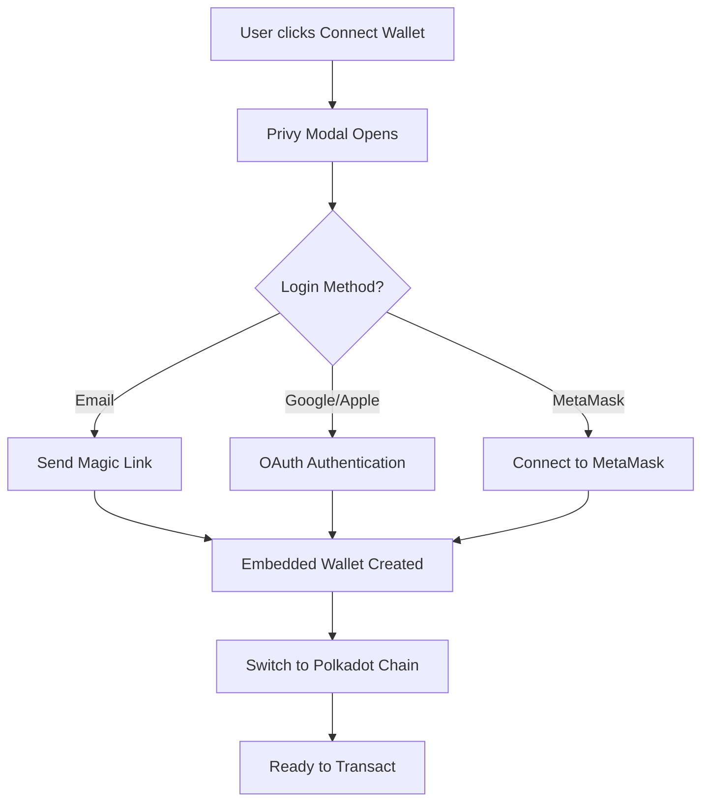

# Polkadot Stablecoin Integration Guide

## Overview

This guide explains how to integrate stablecoins (USDC, USDT) and native tokens (PASS/DOT) with Polkadot Asset Hub for your Peys hackathon project.

## Why Polkadot is Different

Polkadot uses a **different asset model** than Ethereum:

| Aspect | Ethereum | Polkadot Asset Hub |
|--------|----------|-------------------|
| **Asset ID** | Contract address (0x...) | Integer (e.g., 1337 for USDC) |
| **Native Token** | ETH (needs WETH wrapper) | DOT/PAS (native, no wrapper needed) |
| **Stablecoins** | ERC-20 contract | Asset ID + ERC20 precompile |

## The Problem You're Facing

Your PeysEscrow contract uses `IERC20(token).transferFrom()`, but on Polkadot:

1. **PASS is the native token** - NOT an ERC-20 contract
2. **USDC has Asset ID 1337** - mapped to ERC20 precompile at specific address
3. **The address `0x00000001000000000000000000000000000007C0` is NOT an ERC-20 contract** - it's the system assets precompile

## Solution: Use USDC on Polkadot

USDC is natively available on Polkadot Asset Hub with Asset ID 1337.

### Step 1: Find the Correct USDC Address

On Polkadot Asset Hub, assets are accessed via **ERC20 Precompiles**. The formula is:

```
Precompile Address = 0x0000000000000000000000000000000000000800 + asset_id
```

For USDC (Asset ID 1337 = 0x539):
```
0x0000000000000000000000000000000000000800 + 0x00000000000000000000000000000539
= 0x0000000000000000000000000000000000000D39
```

### Step 2: Update Configuration

Update `.env` file:

```env
# Polkadot USDC (Asset ID 1337)
VITE_USDC_ADDRESS_POLKADOT=0x0000000000000000000000000000000000000D39

# Keep PASS as native token display
VITE_PASS_ADDRESS_POLKADOT=0x00000001000000000000000000000000000007c0
```

### Step 3: Configure Wallet for Polkadot

The Privy wallet configuration in `src/contexts/PrivyContext.tsx` already supports Polkadot Asset Hub. The wallet will:

1. Create an embedded wallet on login
2. Support multiple chains (Polkadot, Base, Celo)
3. Allow users to switch networks

## Wallet Integration

### How Wallets Work on Polkadot

Polkadot Asset Hub uses **EVM-compatible addresses**:
- Your wallet address format is the same as Ethereum
- You can use MetaMask, Coinbase Wallet, or Privy embedded wallets
- The wallet handles the Polkadot-specific RPC connection

### Supported Wallets

| Wallet | Support | Notes |
|--------|---------|-------|
| **Privy Embedded** | ✅ Full | Created automatically on email login |
| **MetaMask** | ✅ Full | Add Polkadot Asset Hub network |
| **Coinbase Wallet** | ✅ Full | Built-in support |
| **Polkadot.js** | ❌ Partial | Not EVM-compatible |

## Network Configuration

### Polkadot Asset Hub (Paseo Testnet)

Add this to MetaMask:

| Field | Value |
|-------|-------|
| **Network Name** | Polkadot Asset Hub Testnet |
| **Chain ID** | 420420417 |
| **RPC URL** | https://eth-asset-hub-paseo.dotters.network |
| **Currency Symbol** | PAS |
| **Block Explorer** | https://polkadot.testnet.routescan.io |

## Smart Contract Considerations

### Current Limitation

Your `PeysEscrow.sol` contract only supports ERC-20 tokens via:
```solidity
IERC20(token).transferFrom(msg.sender, address(this), amount);
```

**For Polkadot native tokens (PASS/DOT)**, this won't work because they're not ERC-20 contracts.

### Recommended Approach for Hackathon

1. **Use USDC for payments** (works via ERC20 precompile)
2. **Show PASS balance** for Polkadot native token display
3. **Document the limitation** in your demo

### Alternative: Multi-Chain Support

Since Polkadot Asset Hub has USDC natively, you can support:

```solidity
// Polkadot USDC (Asset ID 1337)
// USDC address: 0x0000000000000000000000000000000000000D39

// Base Sepolia USDC
// USDC address: 0x036CbD53842c5426634e7929541eC2318f3dCF7e
```

## Testing on Polkadot

### Step 1: Get Test Tokens

You can get test DOT/PAS from:

1. **Polkadot Faucet**: https://polkadot.js.org/apps/#/accounts
2. **Paseo Testnet Faucet**: Join Discord for test tokens
3. **USDC on Polkadot**: Transfer from Circle or other exchanges (mainnet)

### Step 2: Send a Test Transaction

Using the updated script:

```bash
# Send USDC on Polkadot
node scripts/send-pass-token.cjs recipient@email.com 2
```

## Wallet Connection Flow



## Debugging Common Issues

### Issue 1: "Address is invalid"
**Cause**: Using PASS token address instead of USDC
**Solution**: Use USDC address `0x0000000000000000000000000000000000000D39`

### Issue 2: "Chain not supported"
**Cause**: Wallet not connected to Polkadot Asset Hub
**Solution**: Switch wallet network in Privy or MetaMask

### Issue 3: "Insufficient funds"
**Cause**: No test tokens
**Solution**: Get test DOT from faucet

## Summary for Hackathon Demo

**What works:**
- ✅ Sending USDC on Polkadot Asset Hub
- ✅ Wallet connection via Privy
- ✅ PASS balance display (native token)

**What's limited:**
- ❌ PASS transfers (requires different contract)
- ❌ Gasless claims (need to configure gas sponsorship)

**Demo script:**
1. Show wallet connection (Privy email login)
2. Display PASS balance (Polkadot native)
3. Send USDC payment on Polkadot
4. Recipient claims via magic link

