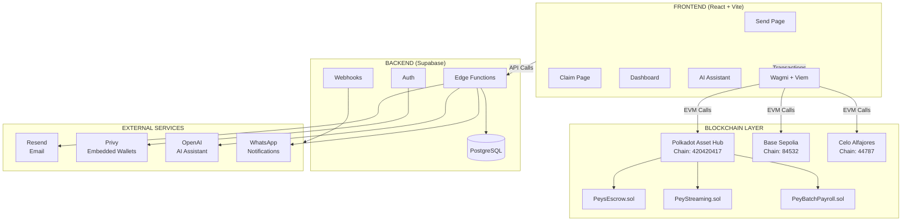
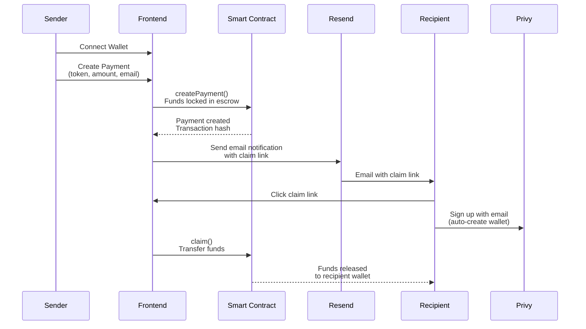
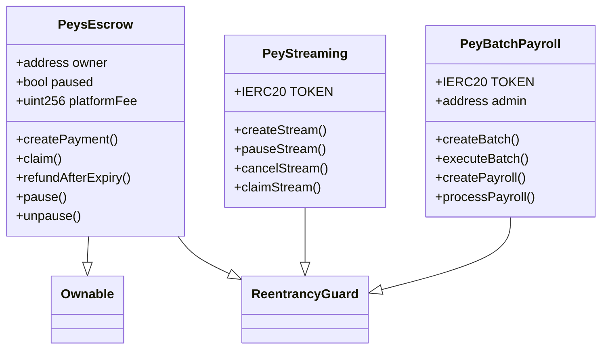
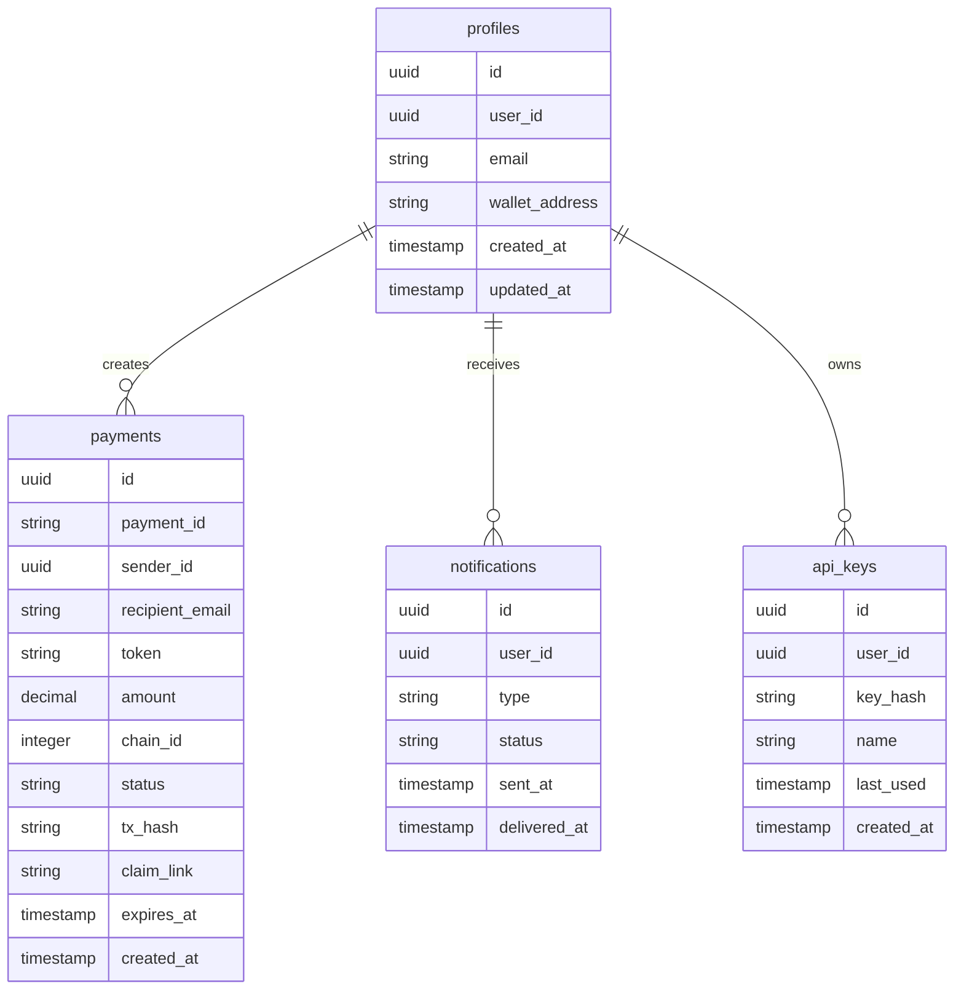

# Peys - Stablecoin Payment Platform

<div align="center">


**The stablecoin payment OS for the Polkadot ecosystem**

[](https://opensource.org/licenses/MIT)
[](https://www.typescriptlang.org/)
[](https://react.dev/)
[](https://polkadot.network/)
[](https://dorahacks.io/hackathon/polkadot-solidity-hackathon)

[Website](https://peys.app) · [Documentation](https://docs.peys.app) · [API](https://api.peys.app) · [GitHub](https://github.com/Moses-main/peydot-magic-links)

</div>

---

## What is Peys?

Peys is a **stablecoin payment platform** that enables anyone to send and receive USDC/USDT/PASS payments using **Magic Claim Links**. Built on **Polkadot Asset Hub** with multi-chain support including Base, Celo, and Ethereum.

### Why Peys?

- **No wallet required** - Recipients claim via email, no crypto experience needed
- **Near-zero fees** - ~$0.01 per transaction on Polkadot
- **Multi-chain** - Deploy on Polkadot, Base, Celo, or Ethereum
- **Secure escrow** - Funds locked until claimed
- **Auto-refunds** - Unclaimed payments return after 7 days

### Hackathon Highlights

| Track | Status |
|-------|--------|
| OpenZeppelin Sponsor Track | ✅ Eligible ($1000 bounty) |
| DeFi / Stablecoin dapps | ✅ Working |
| AI-powered dapps | 🔶 Payment Assistant |
| Polkadot Native Assets | ✅ PASS token |
| Precompiles | ✅ ERC20 |

---

## Quick Start

### Installation

```bash
# Clone the repository
git clone https://github.com/Moses-main/peydot-magic-links.git
cd peydot-magic-links

# Install dependencies
npm install

# Copy environment file
cp .env.example .env

# Start development server
npm run dev
```

### Create a Payment

```typescript
import { Peys } from '@peys/sdk';

const peys = new Peys({ apiKey: 'your_api_key' });

const payment = await peys.payments.create({
  amount: 100,
  token: 'USDC',
  recipient: 'recipient@email.com',
  message: 'Thanks for the work!'
});

console.log(payment.link);
// https://peys.app/claim/abc123
```

---

## Architecture

### System Overview



### Payment Flow



### Smart Contracts



### Database Schema



---

## Supported Networks

| Network | Chain ID | Status | Tokens | RPC |
|---------|----------|--------|--------|-----|
| **Polkadot Asset Hub** (Paseo) | 420420417 | ✅ Active | PASS | `https://eth-rpc-testnet.polkadot.io` |
| **Base Sepolia** | 84532 | ✅ Active | USDC | `https://sepolia.base.org` |
| **Celo Alfajores** | 44787 | ✅ Active | USDC, USDT | `https://alfajores-forno.celo-testnet.org` |
| **Base Mainnet** | 8453 | 🔶 Coming Soon | USDC, USDT | `https://mainnet.base.org` |
| **Ethereum Mainnet** | 1 | 🔶 Coming Soon | USDC, USDT | `https://eth.llamarpc.com` |

---

## API Reference

### REST Endpoints

```base
https://api.peys.app/v1
```

### Authentication

```bash
curl -H "Authorization: Bearer sk_live_..." \
     https://api.peys.app/v1/payments
```

### Key Endpoints

| Method | Endpoint | Description |
|--------|----------|-------------|
| POST | `/v1/payments` | Create a payment |
| GET | `/v1/payments/:id` | Get payment details |
| POST | `/v1/payments/:id/claim` | Claim a payment |
| GET | `/v1/payments` | List payments |
| GET | `/v1/balance` | Get account balance |
| POST | `/v1/webhooks` | Register webhook |

### Webhook Events

- `payment.created` - New payment created
- `payment.claimed` - Payment claimed
- `payment.expired` - Payment link expired
- `payment.refunded` - Payment refunded

---

## Tech Stack

### Frontend
- **React 18** - UI Framework
- **TypeScript** - Type Safety
- **Vite** - Build Tool
- **Wagmi + Viem** - Blockchain Interactions
- **Privy** - Embedded Wallets
- **Tailwind CSS** - Styling
- **Framer Motion** - Animations

### Backend
- **Supabase** - Database & Edge Functions
- **PostgreSQL** - Data Persistence
- **Resend** - Email Service
- **Deno** - Edge Runtime

### Smart Contracts
- **Solidity 0.8** - Contract Language
- **Foundry** - Development Framework
- **OpenZeppelin** - Security Libraries

### Infrastructure
- **Vercel** - Frontend Hosting
- **Polkadot** - Multi-chain Support

---

## Deployment

### Smart Contracts

```bash
cd contracts

# Build contracts
forge build

# Deploy to Polkadot Testnet
forge script script/DeployPolkadot.s.sol --rpc-url polkadotHubTestnet --broadcast --private-key $PRIVATE_KEY
```

### Frontend

```bash
# Build for production
npm run build

# Deploy to Vercel
vercel --prod
```

### Environment Variables

See `.env.example` for required configuration.

---

## Hackathon Submission

### Demo Video

Watch our demo: [Peys Demo Video](./docs/demo-video.md)

### Key Features Implemented

1. ✅ Magic Claim Links - Send crypto via email
2. ✅ Multi-chain Support - Polkadot, Base, Celo
3. ✅ PASS Token - Native Polkadot asset via ERC20 precompile
4. ✅ OpenZeppelin Contracts - Ownable, ReentrancyGuard
5. ✅ AI Payment Assistant - Natural language interface
6. ✅ WhatsApp Notifications - Alternative delivery
7. ✅ Embedded Wallets - Privy integration

### Contract Addresses

| Network | Escrow Contract |
|---------|-----------------|
| Polkadot (Paseo) | `0x802a6843516f52144b3f1d04e5447a085d34af37` |
| Base Sepolia | `0x4a5a67a3666A3f26bF597AdC7c10EA89495e046c` |

---

## Contributing

See [CONTRIBUTING.md](./CONTRIBUTING.md) for details.

---

## License

See [LICENSE](./LICENSE) for details.

---

## Support

- **Email**: peys.xyz@gmail.com
- **Discord**: [Join our community](https://discord.gg/peys)
- **X**: [@Peys_io](https://x.com/Peys_io)
- **GitHub**: [Open an issue](https://github.com/Moses-main/peydot-magic-links/issues)

---

<div align="center">

**Built for the future of payments** 🌍

[](https://polkadot.network/)
[](https://dorahacks.io)

</div>
