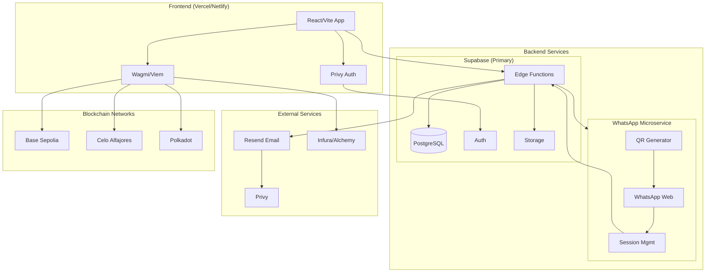
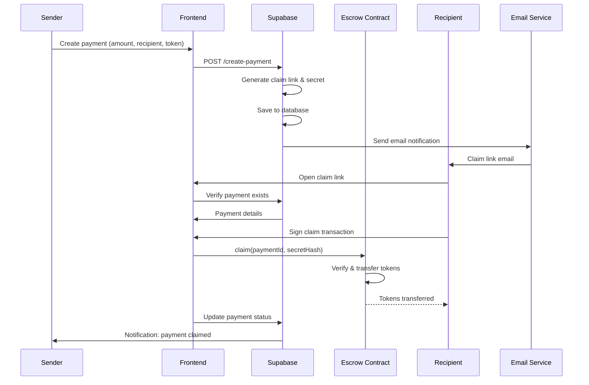
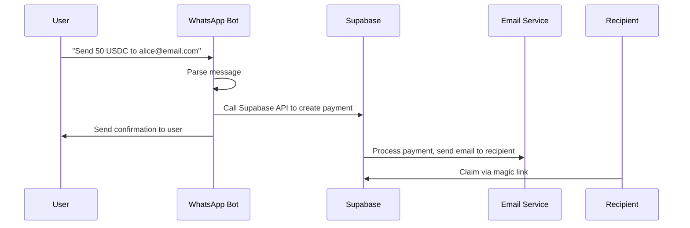
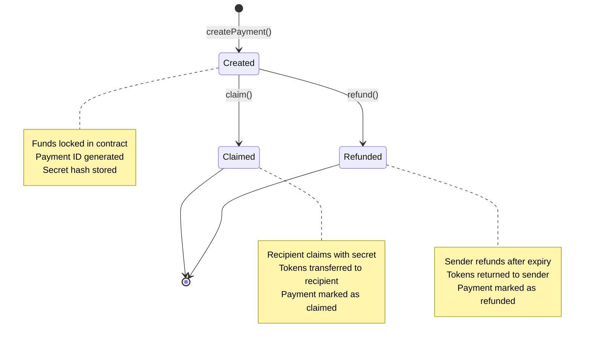
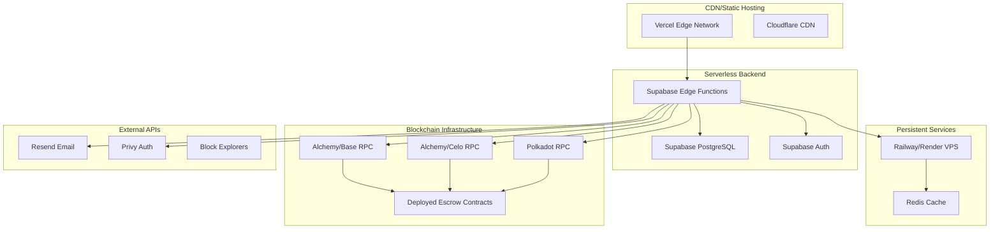
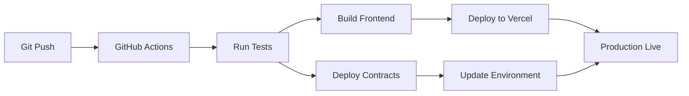
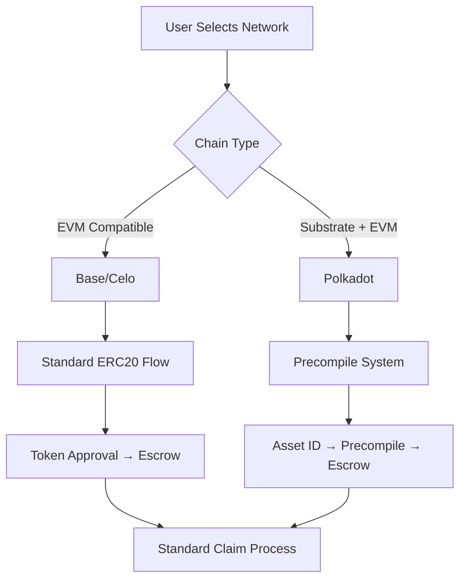

# Peys — Stablecoin Payments via Magic Links

Send USDC/USDT/PASS to anyone using a magic claim link — no wallet required on the recipient's end. Built on Base, Celo, and Polkadot.

## 🏗️ Architecture Overview

PeyDot uses a **hybrid architecture** combining Supabase Edge Functions with a dedicated WhatsApp microservice for optimal cost and functionality.

### High-Level Architecture



## 🔄 Payment Flow

### Magic Link Payment Flow



### WhatsApp Payment Flow



## 🏛️ Smart Contract Architecture

### Escrow Contract Flow



## 📊 Database Schema

```mermaid
erDiagram
    PROFILES {
        id uuid PK
        email string unique
        user_id string
        created_at timestamp
        updated_at timestamp
    }
    
    PAYMENTS {
        id uuid PK
        payment_id string unique
        sender_email string
        recipient_email string
        amount decimal
        token string
        memo text
        status enum
        claim_secret string
        claim_link string unique
        blockchain_payment_id string
        tx_hash string
        chain_id integer
        expires_at timestamp
        claimed_at timestamp
        claimed_by_user_id uuid FK
        created_at timestamp
    }
    
    NOTIFICATIONS {
        id uuid PK
        user_id uuid FK
        type string
        title string
        message text
        payment_id uuid FK
        read boolean
        created_at timestamp
    }
    
    PROFILES ||--o{ PAYMENTS : sends
    PROFILES ||--o{ PAYMENTS : receives
    PROFILES ||--o{ NOTIFICATIONS : receives
    PAYMENTS ||--o{ NOTIFICATIONS : triggers
```

## 🚀 Deployment Architecture

### Production Architecture



## 📁 Project Structure

```
peydot-magic-links/
├── 📱 src/                    # React 18 + TypeScript frontend (Vite)
│   ├── components/            # Reusable UI components
│   │   ├── ui/             # Base UI components (shadcn/ui)
│   │   ├── SendPaymentForm.tsx
│   │   ├── ClaimPage.tsx
│   │   └── ...
│   ├── pages/                # Route pages
│   │   ├── Index.tsx
│   │   ├── SendPage.tsx
│   │   ├── ClaimPage.tsx
│   │   └── DashboardPage.tsx
│   ├── contexts/             # React contexts
│   │   ├── AppContext.tsx
│   │   └── PrivyContext.tsx
│   ├── hooks/                # Custom React hooks
│   │   ├── useEscrow.ts
│   │   └── ...
│   ├── lib/                  # Utility libraries
│   │   ├── chains.ts
│   │   └── polkadotPvm.ts
│   └── utils/                # Helper functions
│       └── confetti.ts
├── 🔧 server/                 # Express backend (shared API)
│   ├── routes/               # API endpoints
│   └── middleware/           # Express middleware
├── 📱 bot/                    # WhatsApp bot (Baileys) — deploy separately
│   ├── server/               # Bot server entry point
│   ├── migrations/           # SQL migrations
│   ├── .env.example
│   └── README.md
├── 📜 contracts/              # Solidity smart contracts (Foundry)
│   ├── src/                  # Contract source files
│   │   ├── PeysEscrow.sol
│   │   └── ...
│   ├── script/                # Deployment scripts
│   │   ├── DeployPolkadot.s.sol
│   │   ├── DeployBaseSepolia.s.sol
│   │   └── DeployCeloAlfajores.s.sol
│   └── test/                 # Contract tests
├── ☁️ supabase/               # Supabase Edge Functions + migrations
│   ├── functions/            # Edge Function implementations
│   └── migrations/           # Database schema migrations
├── 📚 sdks/                   # JS, Python, Go SDKs
│   ├── javascript/
│   ├── python/
│   └── go/
├── 📖 docs/                   # API reference and documentation
│   ├── api-reference.md
│   └── architecture.md
├── 🔐 .env.example            # Environment variables template
├── 📦 package.json            # Dependencies and scripts
└── 🎯 README.md               # This file
```

## 🛠️ Technology Stack

### Frontend
- **React 18** - UI framework with hooks and concurrent features
- **TypeScript** - Type safety and developer experience
- **Vite** - Fast build tool and dev server
- **TailwindCSS** - Utility-first CSS framework
- **Framer Motion** - Smooth animations and transitions
- **shadcn/ui** - Modern component library
- **React Router** - Client-side routing
- **Wagmi + Viem** - Ethereum/Polkadot wallet integration
- **Privy** - Embedded wallet authentication

### Backend
- **Supabase** - Backend-as-a-Service
  - PostgreSQL database
  - Edge Functions (serverless)
  - Real-time subscriptions
  - Authentication
  - File storage
- **Express.js** - Traditional API endpoints
- **WhatsApp Bot** - Baileys library for WhatsApp Web

### Blockchain
- **Solidity** - Smart contract language
- **Foundry** - Development framework
- **Multi-chain Support**:
  - Base Sepolia (Ethereum L2)
  - Celo Alfajores (EVM-compatible)
  - Polkadot Asset Hub (Substrate + EVM)

### Infrastructure
- **Vercel** - Frontend hosting
- **Railway/Render** - Backend hosting
- **Supabase** - Database and serverless functions
- **Resend** - Email delivery service

## 🚀 Quick Start

### Prerequisites
- Node.js 18+
- npm or yarn
- Git

### Main App Setup

```bash
# Clone repository
git clone https://github.com/your-username/peydot-magic-links.git
cd peydot-magic-links

# Install dependencies
npm install

# Set up environment variables
cp .env.example .env
# Edit .env with your API keys and configurations

# Start development server
npm run dev
```

### WhatsApp Bot Setup

The bot runs separately on a persistent server (Railway, Render, VPS).

```bash
cd bot
npm install
cp .env.example .env
# Edit .env with your configurations
npm start              # scan the QR code on first run
```

### Smart Contract Deployment

```bash
cd contracts
forge build
forge script script/DeployPolkadot.s.sol --rpc-url $VITE_RPC_URL_POLKADOT --broadcast --verify
forge script script/DeployBaseSepolia.s.sol --rpc-url $VITE_RPC_URL_BASE_SEPOLIA --broadcast --verify
forge script script/DeployCeloAlfajores.s.sol --rpc-url $VITE_RPC_URL_CELO --broadcast --verify
```

## ⚙️ Environment Variables

### Required Variables

| Variable | Description | Example |
|---|---|---|
| `VITE_SUPABASE_URL` | Supabase project URL | `https://xxx.supabase.co` |
| `VITE_SUPABASE_ANON_KEY` | Supabase anon key | `eyJhbGciOiJIUzI1NiIs...` |
| `VITE_PRIVY_APP_ID` | Privy app ID | `cmlpmbwgn00cb0dicbfwdkz40` |
| `PRIVATE_KEY` | Wallet private key | `0xcb601f9647fa12dea8081b5bfed574f40f4f41996401ea5901bcb314392e90e9` |

### Network Configuration

| Network | Chain ID | RPC URL | Escrow Contract |
|---|---|---|---|
| Polkadot Asset Hub | 420420417 | `https://eth-asset-hub-paseo.dotters.network` | `0x802a6843516f52144b3f1d04e5447a085d34af37` |
| Base Sepolia | 84532 | `https://base-sepolia.g.alchemy.com/v2/H3-pV1jNnbXq7-6JEW8Gt` | `0x4a5a67a3666A3f26bF597AdC7c10EA89495e046c` |
| Celo Alfajores | 44787 | `https://celo-sepolia.g.alchemy.com/v2/H3-pV1jNnbXq7-6JEW8Gt` | `0xc880AF5d5aC3ea27c26C47D132661A710C245ea5` |

### Token Addresses

| Network | USDC | USDT | PASS |
|---|---|---|---|
| Polkadot | `0x0000000000000000000000000000000000000D39` | Not available | Native token |
| Base Sepolia | `0x036CbD53842c5426634e7929541eC2318f3dCF7e` | Not available | Not available |
| Celo Alfajores | `0x01C5C0122039549AD1493B8220cABEdD739BC44E` | Not available | Not available |

## 🚀 Deployment

### Production Hosting

| Component | Platform | Cost | Notes |
|---|---|---|---|
| Frontend | Vercel | Free tier | Auto-deploy from main branch |
| Backend | Supabase Edge Functions | $0-25/month | 500K invocations/month |
| WhatsApp Bot | Railway/Render | $5-10/month | Must be persistent for sessions |
| Database | Supabase PostgreSQL | Free tier | 500MB storage, 2GB bandwidth |
| Email | Resend | $0-10/month | 3K free emails/month |

### CI/CD Pipeline



## 🔧 Development Scripts

```bash
# Development
npm run dev              # Start development server
npm run build            # Build for production
npm run preview          # Preview production build

# Testing
npm run test             # Run unit tests
npm run test:watch       # Run tests in watch mode

# Smart Contracts
npm run contract:build   # Build contracts
npm run contract:test     # Test contracts
npm run contract:deploy:polkadot    # Deploy to Polkadot
npm run contract:deploy:base-sepolia   # Deploy to Base Sepolia
npm run contract:deploy:celo-alfajores  # Deploy to Celo

# Linting
npm run lint             # Run ESLint
```

## 🔐 Security Considerations

### Smart Contract Security
- ✅ **Reentrancy Protection** - Uses OpenZeppelin's ReentrancyGuard
- ✅ **Access Control** - Only authorized functions can be called
- ✅ **Input Validation** - All inputs validated before processing
- ✅ **Emergency Refunds** - Sender can refund after expiry
- ✅ **Secret Protection** - Claim secrets are hashed using keccak256

### Backend Security
- ✅ **Row Level Security** - Database access controls
- ✅ **Environment Variables** - Sensitive data never in code
- ✅ **API Rate Limiting** - Prevents abuse
- ✅ **Input Sanitization** - All user inputs validated
- ✅ **HTTPS Only** - All communications encrypted

### Frontend Security
- ✅ **Privy Authentication** - Enterprise-grade wallet security
- ✅ **Content Security Policy** - Prevents XSS attacks
- ✅ **Environment Isolation** - Different configs per environment

## 📊 Performance Metrics

### Target Performance
- **Transaction Speed**: < 3 seconds confirmation
- **UI Response**: < 100ms interaction response
- **Email Delivery**: < 5 seconds to recipient
- **Bot Response**: < 2 seconds to WhatsApp message
- **Uptime**: 99.9% availability target

### Monitoring
- **Frontend**: Vercel Analytics + Sentry
- **Backend**: Supabase Dashboard + custom logging
- **Blockchain**: Tenderly/GoldRush for contract monitoring
- **WhatsApp**: Custom bot health checks

## 🌍 Multi-Chain Strategy

### Chain Selection Logic



### Asset Handling Differences

| Feature | Ethereum L2s | Polkadot Asset Hub |
|---|---|---|
| **Token Model** | ERC-20 contracts | Asset IDs + precompiles |
| **Native Token** | ETH (wrapped) | PAS (native) |
| **Gas Token** | ETH | PAS |
| **Cross-chain** | Bridges | XCM built-in |
| **Finality** | ~2 seconds | ~6 seconds |

## 🚀 API Documentation

### Core Endpoints

#### Payment Creation
```typescript
POST /api/v1/payments/create
{
  recipient_email: string;
  amount: string;
  token: "USDC" | "USDT" | "PASS";
  memo?: string;
  chain_id: number;
}
```

#### Payment Claim
```typescript
POST /api/v1/payments/{paymentId}/claim
{
  claim_secret: string;
  recipient_wallet: string;
}
```

#### Payment Status
```typescript
GET /api/v1/payments/{paymentId}
Response: {
  id: string;
  status: "pending" | "claimed" | "refunded" | "expired";
  amount: string;
  token: string;
  recipient_email: string;
  expires_at: string;
}
```

## 🤝 Contributing

### Development Workflow
1. Fork the repository
2. Create feature branch: `git checkout -b feature/amazing-feature`
3. Make changes and test thoroughly
4. Commit changes: `git commit -m "Add amazing feature"`
5. Push to fork: `git push origin feature/amazing-feature`
6. Create Pull Request

### Code Standards
- **TypeScript** for all new code
- **ESLint** configuration must pass
- **Tests** required for new features
- **Documentation** for public APIs
- **Security review** for contract changes

## 📄 License

This project is licensed under the **MIT License** - see the [LICENSE](LICENSE) file for details.

## 🙏 Acknowledgments

- **Supabase** - Backend-as-a-Service platform
- **Privy** - Embedded wallet infrastructure
- **OpenZeppelin** - Secure smart contract library
- **Wagmi/Viem** - Modern Ethereum/Polkadot libraries
- **Baileys** - WhatsApp Web library
- **Foundry** - Smart contract development framework

---

## 📞 Support

- **Documentation**: [docs.peydot.io](https://docs.peydot.io)
- **API Reference**: [api.peydot.io](https://api.peydot.io)
- **Issues**: [GitHub Issues](https://github.com/your-username/peydot-magic-links/issues)
- **Discord**: [Community Discord](https://discord.gg/peydot)
- **Email**: [support@peydot.io](mailto:support@peydot.io)

---

*Built with ❤️ for the future of cross-border payments*
